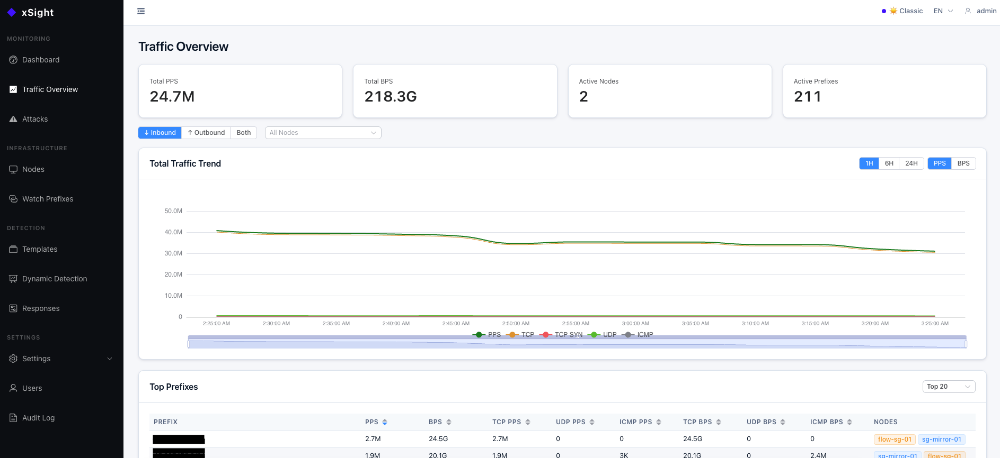
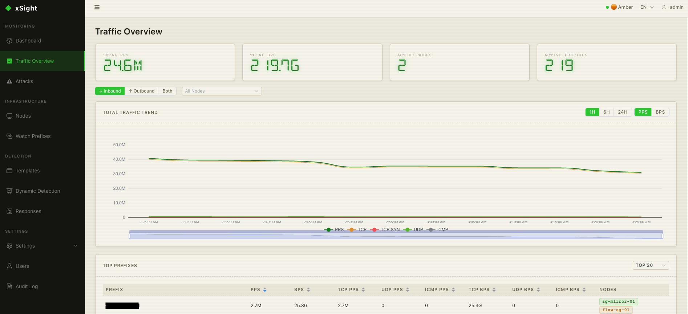

<div align="center">
  

  <h1>xSight</h1>

  <p>Distributed DDoS detection and response platform built on XDP/eBPF — wire-speed traffic analysis with automated mitigation.</p>

  [](https://go.dev)
  [](https://vuejs.org)
  [](LICENSE)
  [](https://claude.com/product/claude-code)

  [中文文档](README.zh.md)
</div>

---

## What is xSight?

xSight is a distributed DDoS detection and response platform that combines XDP/eBPF wire-speed packet counting with flow-based analysis (sFlow, NetFlow, IPFIX). It watches traffic on mirror/ERSPAN ports or ingests flow data from routers and switches, detects volumetric attacks using both hard thresholds and dynamic baselines, and triggers automated responses — from BPF-level firewall rules to BGP blackhole announcements.

The system has two components:

- **Node** — deployed at each observation point, captures traffic via XDP or receives flow data, counts per-IP/per-protocol statistics, and streams them to the controller over gRPC
- **Controller** — central management plane that runs the detection engine, stores time-series data in TimescaleDB, triggers response actions, and serves the Web UI

| Classic Theme | Amber Theme |
|:---:|:---:|
|  |  |

```
┌──────────────────────────────────────────────────────────────────────────┐
│                          Controller (Detection Plane)                    │
│                                                                          │
│  ┌──────────┐  ┌──────────┐  ┌──────────┐  ┌──────────┐  ┌───────────┐ │
│  │  Web UI  │  │ HTTP API │  │Detection │  │ Response │  │TimescaleDB│ │
│  │ (Vue 3 + │  │  (Gin)   │  │ Engine   │  │ Actions  │  │    (PG)   │ │
│  │  EPlus)  │  │          │  │          │  │          │  │           │ │
│  └──────────┘  └──────────┘  └──────────┘  └──────────┘  └───────────┘ │
└────────────────────────────────┬─────────────────────────────────────────┘
                                 │  gRPC (stats streaming + config publish)
             ┌───────────────────┼───────────────────┐
             ▼                   ▼                   ▼
      ┌─────────────┐    ┌─────────────┐    ┌─────────────┐
      │  Node 1     │    │  Node 2     │    │  Node N     │
      │  (XDP mode) │    │ (Flow mode) │    │  (XDP mode) │
      │ ┌─────────┐ │    │ ┌─────────┐ │    │ ┌─────────┐ │
      │ │ BPF/XDP │ │    │ │  sFlow  │ │    │ │ BPF/XDP │ │
      │ │ counter │ │    │ │ NetFlow │ │    │ │ counter │ │
      │ └─────────┘ │    │ └─────────┘ │    │ └─────────┘ │
      └─────────────┘    └─────────────┘    └─────────────┘
       Mirror/ERSPAN      Router/Switch      Mirror/ERSPAN
```

---

## Key Features

### Dual Capture Mode

| Mode | How it works | Use case |
|------|-------------|----------|
| **XDP** | BPF program on mirror/ERSPAN port counts packets at wire speed | High-accuracy, per-packet visibility |
| **Flow** | sFlow, NetFlow v5/v9, IPFIX receiver with multi-source support | Router/switch integration, no kernel dependency |

### Detection Engine
- **Hard threshold detection** — per-decoder limits for TCP, TCP SYN, UDP, ICMP, and IP (both PPS and BPS)
- **Dynamic baseline detection** — EWMA with 168-slot weekly profile (one slot per hour); alerts on percentage deviation from learned baseline
- **Bidirectional detection** — monitors both inbound and outbound traffic independently
- **Global carpet bomb detection** — 0.0.0.0/0 aggregate threshold catches distributed attacks spread across many IPs
- **Per-decoder granularity** — separate thresholds and baselines for each protocol decoder

### Response System
| Action | Description |
|--------|-------------|
| **xDrop** | Push BPF firewall rules to xDrop nodes for wire-speed blocking |
| **BGP RTBH** | Announce /32 blackhole routes via BGP for upstream null-routing |
| **Webhook** | HTTP callback to external systems (SIEM, Slack, PagerDuty, etc.) |
| **Shell** | Execute local scripts for custom automation |

- **Auto-paired actions** — creating an xDrop/BGP `on_detected` action auto-creates the matching `on_expired` cleanup (unblock / withdraw), kept in sync through the parent's lifecycle
- **Auto `tcp_flags` injection** — SYN flood events automatically add `tcp_flags=SYN` to xDrop rules for precision blocking without collateral damage
- **xDrop decoder compatibility gate** — xDrop is L4-only; `ip` (L3 aggregate) attacks are skipped with `decoder_not_xdrop_compatible` so they don't degrade into full-prefix blackholes. Use BGP for those.
- **Shared BGP announcements (Wanguard-style)** — multiple attacks sharing a `(prefix, route_map)` ref a single FRR route. MAX delay across attached attacks, atomic attach/detach under `SELECT FOR UPDATE`.
- **Persisted delayed tasks** — `scheduled_actions` table survives controller restart; startup reconciliation re-arms pending timers, fires overdue tasks, retries in-flight crashed tasks.
- **FRR orphan detection** — startup scan surfaces FRR routes with no backing xSight attack so operators can withdraw or dismiss them.

### Active Mitigations & Per-Attack Drilldown
- Dedicated `Active Mitigations` page with BGP Routing + xDrop Filtering tabs and a detail drawer per artifact (Summary / Configuration / Execution Timeline).
- Attack Detail shows a `BGP Role` column (`triggered` vs `attached` to a shared announcement) and per-attack Force Remove so a single attack can be detached without withdrawing the shared route.

### Observability
- Prometheus `/metrics` endpoint with ~15 xSight-specific metrics (vtysh ops, action dispatches, skip reasons, scheduled-action recovery outcomes, state-table gauges, tracker counters) plus Go runtime / process metrics for free.
- Custom collectors read DB state at scrape time — always fresh, no staleness window, no background refresh goroutine.

### Traffic Analysis
- **Flow fingerprint** — 5-tuple sampling during attacks captures top talkers and protocol distribution
- **Sensor logs** — per-event structured logs with full decoder breakdown
- **Per-IP tracking** — real-time per-destination PPS/BPS with configurable aggregation windows

### Web UI
- **Dual themes** — Classic (Stripe-inspired clean) and Amber (DSEG14 LCD retro aesthetic)
- **Internationalization** — full English and Chinese (ZH/EN toggle)
- **Real-time dashboards** — traffic overview, per-IP drilldown, alert timeline, response history
- **Config management** — detection profiles, response actions, and node configuration from the browser

### Data Pipeline
- **TimescaleDB** — continuous aggregates for efficient time-range queries, automatic compression, and configurable retention policies
- **Config publish pipeline** — Controller pushes detection/response configuration to nodes via gRPC `ControlStream`, ensuring all nodes stay in sync without polling

---

## Repository Layout

```
xsight/
├── controller/          # Management plane (Go + Vue 3)
│   ├── internal/        # API, detection engine, tracker, actions, store
│   └── web/             # Vue 3 + Element Plus frontend
├── node/                # Data plane (Go + BPF/XDP)
│   ├── internal/        # BPF loader, reporter, sampler, flow decoder
│   └── bpf/             # XDP kernel program (C)
├── shared/              # Shared decoder package
├── proto/               # gRPC service definition
├── scripts/             # Build & service management
├── deploy/              # systemd unit files
└── .github/assets/      # Logo, screenshots, sponsor
```

---

## Requirements

| Component | Requirements |
|-----------|-------------|
| Controller | Go 1.25+, Node.js 18+ (frontend build), PostgreSQL 15+ with TimescaleDB |
| Node (XDP mode) | Linux kernel 5.4+, clang/llvm 11+, Go 1.25+, root / CAP_NET_ADMIN |
| Node (Flow mode) | Go 1.25+, no special kernel or root privileges needed |

**Hardware (Controller — includes PostgreSQL + TimescaleDB):**

| | CPU | RAM | Disk | Use Case |
|--|-----|-----|------|----------|
| **Minimum** | 4 cores | 8 GB | 40 GB SSD | Small networks, fewer prefixes |
| **Recommended** | 8 cores | 16 GB | 80 GB SSD | Production, high-traffic environments |

**Hardware (Node):**

| | CPU | RAM | Disk | Notes |
|--|-----|-----|------|-------|
| XDP mode | 2+ cores | 2 GB+ | 10 GB | Minimal — most work is in BPF kernel space |
| Flow mode | 2+ cores | 2 GB+ | 10 GB | Scales with number of flow exporters |

> **XDP mode** requires Linux — the BPF program attaches to the kernel's XDP hook. **Flow mode** and the **Controller** can run on any OS.

For a step-by-step environment setup guide, see **[Getting Started](GETTING_STARTED.md)**.

---

## Quick Start

### 1. Build

```bash
# Build controller (frontend + Go binary)
./scripts/build-controller.sh

# Build node (BPF program + Go binary) — run on a Linux host
./scripts/build-node.sh
```

### 2. Configure

```bash
# Controller
cp controller/config.example.yaml controller/config.yaml
# Edit: set database DSN, gRPC listen address, detection profiles

# Node
cp node/config.example.yaml node/config.yaml
# Edit: set capture mode (xdp/flow), interface, controller gRPC address
```

### 3. Start

```bash
# Controller (no root required)
./scripts/controller.sh start

# Node — XDP mode (requires root)
sudo ./scripts/node.sh start

# Node — Flow mode (no root required)
./scripts/node.sh start

# Check status
./scripts/controller.sh status
./scripts/node.sh status
```

The Web UI is available at `http://<controller-host>:8080`. Default login: **admin / admin** — change the password immediately after first login.

---

## License

MIT — see [LICENSE](LICENSE).

BPF/C kernel programs (`node/bpf/`) are licensed under GPL-2.0 as required by the Linux kernel BPF subsystem.

---

## Sponsor

This project is made possible by [Hytron](https://www.hytron.io/), who generously sponsors the development tooling.

<picture>
  <source media="(prefers-color-scheme: dark)" srcset=".github/assets/sponsor-hytron-dark.png">
  
</picture>

---

<sub>Built entirely with <a href="https://claude.com/product/claude-code">Claude Code</a> — including the XDP/BPF kernel program, gRPC streaming, detection engine, and Vue frontend.</sub>
